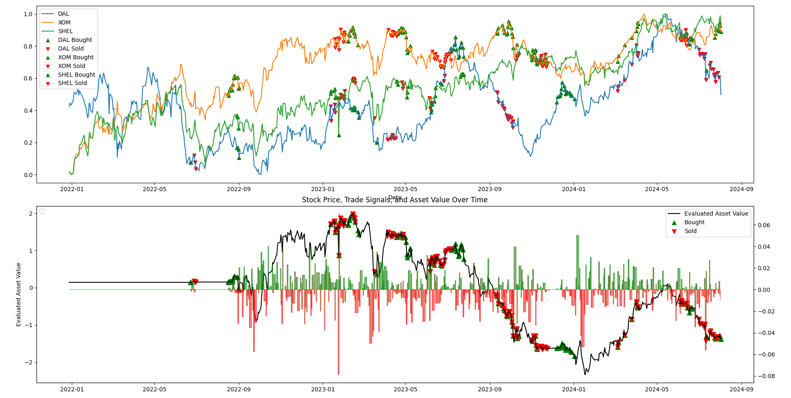
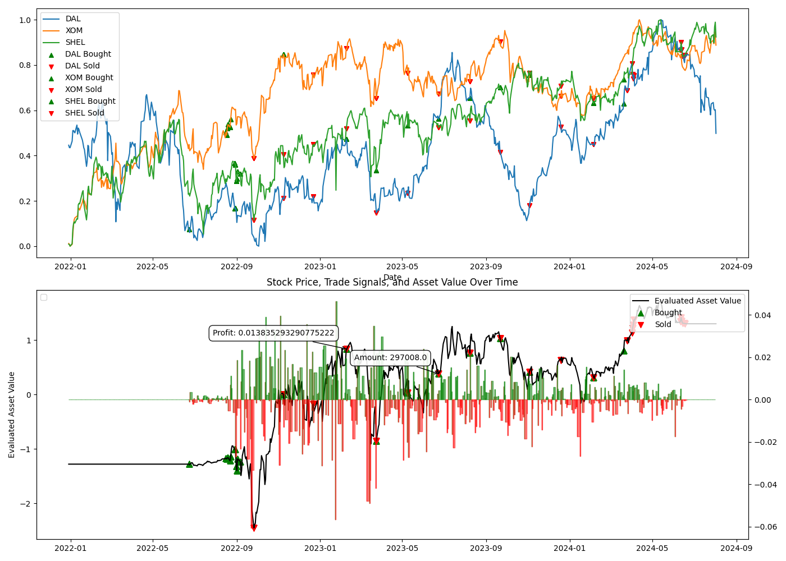

# 3축 헷지 전략

### 간략 소개
**3축 헷지**는 옵션, 선물, ELW 등의 파생상품이나 레버리지 ETF 없이도 **1개의 수익용 종목(A)**과 **2개의 헷지용 종목(B1, B2)**을 활용해 리스크를 분산하고 수익을 극대화하는 전략입니다.

 

## 전략 구성 요소

### 1. **조건**
- **A (수익용 종목)**: B1, B2와의 상관계수(Pearson Correlation)가 **-1**에 가까워야 합니다.
- **B1, B2 (헷지용 종목)**: A의 가격 상승 시 B1, B2는 하락해야 하지만, B1, B2 간에는 **양의 상관관계**가 존재해야 합니다.

> 💡 **TIP:**  
> B1과 B2의 상관계수를 활용하여 리스크를 조정할 수 있습니다.
 

### 2. **작동 과정**

#### **매집 기간**
- A를 초기 자산의 20~40%만큼 매수합니다.
- B1, B2도 남은 비율에 맞춰 매수합니다.
- 주가는 다항함수로 모델링되며, **극대와 극소에서 매매**하는 **Local BNS 알고리즘**이 사용됩니다.

#### **헷지 기간**
- **헷지 조건**: 
  1. 충분한 매집이 이루어졌는가?  
  2. 자산 대비 리스크 한도(R/H ratio)가 1에 근접하는가?

헷지가 시작되면, 4가지 시나리오에 대비합니다:
1. **포트폴리오 재조정**  
2. **A 주식 매매에 따른 B1, B2 조정**  
3. **B1, B2 보유량 감소에 따른 A 비중 매도**  
4. **헷지 불능 상태에서 자산 청산**  
 
### 3. **헷지 단계별 작동**

#### 1. **포트폴리오 재조정**
- A, B1, B2의 보유 비중을 **이상적 비율**로 재조정합니다.
- **H와 A 비중**을 기반으로 리스크 관리 비중을 결정합니다.

#### 2. **A 주식 매매에 따른 B1, B2 조정**
- A 비중이 달라질 때, B1, B2도 **최적화**하여 조정합니다.
- A의 비중에 맞춰 **B1, B2의 비율**을 재조정하여 수익성을 개선할 수 있습니다.

#### 3. **B1, B2 보유량 감소에 따른 A 비중 매도**
- **B1, B2 조정 후** A의 비중을 추가로 매도하여 리스크를 관리합니다.

#### 4. **헷지 불능 상태에서 자산 청산**
- **헷지 불능 상태**란, B1, B2의 비중이 적어져 리스크 관리가 불가능한 경우입니다.
- 이때는 **Local BNS 알고리즘**을 활용해 주식 청산을 진행합니다.

 

## 백테스트 결과

### 헷지 없이 (No Hedge)
  
Local BNS 알고리즘만으로 매매를 진행할 경우, 시장의 변동성에 따라 자산이 큰 폭으로 요동칩니다.

 

### 헷지 적용 시 (With Hedge)
  
헷지를 적용한 경우, A, B1, B2의 **상관관계**를 이용해 다양한 시점에서 발생하는 하락에도 불구하고 자산은 지속적으로 상승합니다.

 

---
> 📈 **결론:**  
> **3축 헷지 전략**은 다양한 시장 환경에서도 수익을 극대화하고 리스크를 효과적으로 관리할 수 있는 주식 매매만을 이용한 간단하고 강력한 헷지 전략입니다.  