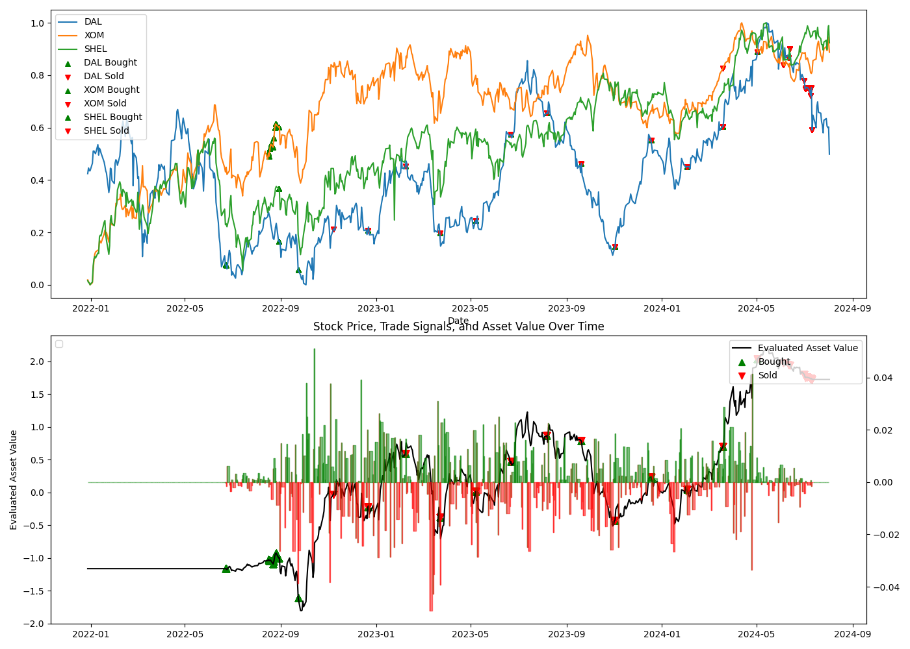

## 3-axis hedge

### 개요
이 `backtest` 함수는 주어진 금융 자산(여러 종목과 시장 지수)을 대상으로 **헷지** 전략을 포함한 매매 전략을 시뮬레이션하는 백테스트 시스템입니다. 주요 목적은 자산 A와 헷지 자산인 B1, B2를 통해 **위험 관리**와 **수익 극대화**를 목표로 포트폴리오를 조정하는 것입니다.

### 주요 기능
1. **헷지 관리**:
   - `hedge_manager`는 자산 A와 헷지 자산 B1, B2 사이의 헷지 비율을 관리합니다. 이를 통해 포트폴리오의 위험을 관리하고 시장 변동성에 대응합니다.
   - `get_hedge_ratio`: A와 B1, B2 자산 간의 헷지 비율을 계산합니다.
   - `optimize_hedging`: 주식 간 헷지를 최적화하여 위험을 낮춥니다.

2. **매매 전략**:
   - 헷지를 하기 위한 자산이 모일 때 까지 매집합니다.
   - Local BNS 알고리즘을 이용하여 매수(`buy`)와 매도(`sell`) 시그널을 생성합니다.
   - 예측된 신호를 기반으로 포트폴리오를 조정하고 헷지 비율을 다시 최적화합니다.
   - 헷지할 자산이 없을 경우 다시 Local BNS 알고리즘대로 매매합니다.

3. **리스크 관리**:
   - `max_risk`로 설정된 한도 내에서 포트폴리오 조정을 진행하며, 헷지 자산의 비중을 적절히 재조정합니다.
   - 자산 B1, B2의 비중이 너무 작아지면 포트폴리오에서 제거하여 차익을 실현합니다.

4. **포트폴리오 최적화**:
   - `optimize_reduction`: 자산 A의 비중을 최적화하여 포트폴리오 전체의 위험을 관리합니다.
   - 포트폴리오 재조정 시에는 각 자산의 목표 비중에 맞춰 매수와 매도를 진행합니다.

#### 헷지하지 않은 것과 한 것의 차이

하지 않은 것

한 것