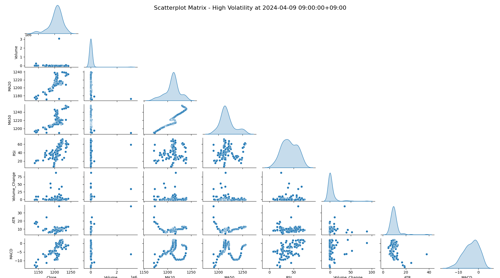

# localbns targets

``` python
def sell_target_function(data, symbol):
    data[f'{symbol}_EMA_Change'] = data[f'{symbol}_EMA_5'].pct_change()
    data[f'{symbol}_ATR_Change'] = data[f'{symbol}_ATR'].pct_change()
    data[f'{symbol}_Signal'] = ((data[f'{symbol}_EMA_Change'].abs() < 0.015) &
                    (data[f'{symbol}_ATR_Change'] > 0.005)).astype(int)
    data.dropna(inplace=True)
    return data

def buy_target_function(data, symbol):
    data['MACD_Change'] = data[f'{symbol}_MACD'].diff()
    data['Bollinger_Lower_Change'] = data[f'{symbol}_Bollinger_lband'].diff()
    data[f'{symbol}_Signal'] = ((data['MACD_Change'].abs() < 0.02) & 
                    (data['Bollinger_Lower_Change'] < -0.003)).astype(int)
    return data
```

# Harpoon

## 고래가 움직이기 7일전부터


